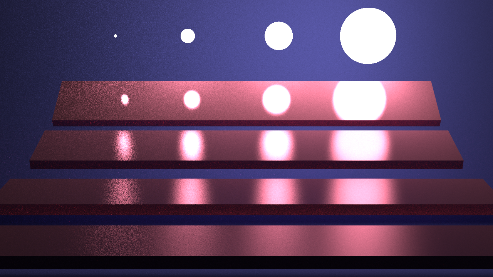

# Real-time Ray Tracing Algorithm

## 基于 Monte Carlo 的路径追踪

- 构建方式：CMake，编译后直接运行 `bin/RayTracing` 可执行文件
- 场景文件位置：imgui 界面中 import 按钮选择 `datasets/` 目录下的 `.xml` 文件
- 输出位置：`bin/`
- 使用的库：`stb_image`、`tiny_obj_loader`、`tinyxml2`、`glm`、`OpenMP`、`imgui`
- 主要技术：
  - 光线与三角面片求交使用`BVH`加速
  - 路径追踪算法（Monte Carlo 近似积分）, `RR`终止
  - 多重重要性采样（光源采样和`BXDF`采样）
  - 纹理采样(diffuse、specular)
  - 支持 `lambertDiffuse`,`phongGlossy`,`specularMirror`,`transmissive`BXDF`计算

## 结果展示

最大弹射次数：5

### Cornell-Box


### Veach-vis



### Bathroom2

由于模型的差异（视口后面的面片未被删除）比起原图会看起来更亮，由于模型法向量并不是向外的，因此代码中求交时会将交点的法线向外。


## 基于 Monte Carlo 的路径追踪的路径追踪算法

路径追踪（Path Tracing）是一种基于蒙特卡洛积分（Monte Carlo Integration） 计算全局光照的渲染方法。它可以模拟光线的多次弹射（bounces），从而生成真实感的间接光照、软阴影、漫反射、折射、焦散等复杂光照效果。路径追踪的核心目标是求解上述的渲染方程。

### 路径追踪的 Monte Carelo 近似

蒙特卡洛路径追踪的核心思想是：

1. **从摄像机发射光线**，找到与场景的交点（**光线投射**）。
2. **随机采样一个反射方向**（根据 `BxDF`重要性采样）。
3. **沿采样方向继续追踪光线**（递归计算反射光）。
4. **在多个路径上取平均值**，最终收敛于真实的光照计算。

我们使用 **蒙特卡洛估计积分**：

$$
L_o(p, \omega_o) \approx L_e(p, \omega_o) + \frac{1}{N} \sum_{i=1}^{N} \frac{f_r(p, \omega_i, \omega_o) L_i(p, \omega_i) (\omega_i \cdot n)}{p(\omega_i)}
$$

其中：

- $N$ 是样本数（采样次数越多，结果越精确）。
  
- $p(\omega_i)$ 是采样方向的概率密度函数（PDF）。

### 伪代码表示

```cpp
vec3 path_tracing(Ray ray, int depth) {
    if (depth == MAX_DEPTH) return vec3(0, 0, 0); // 终止递归
    
    Intersection hit = scene_intersect(ray);
    if (!hit) return vec3(0, 0, 0); // 没有交点，返回黑色
    
    vec3 Lo = hit.Le;  // 自发光贡献
    
    // 重要性采样方向
    vec3 wi = sample_dir(hit.normal);
    Ray new_ray(hit.position, wi);
    vec3 Li = path_tracing(new_ray, depth + 1); // 递归计算间接光
    
    double BRDF = eval_BRDF(hit, wi, ray.direction);
    double cosine_term = dot(wi, hit.normal);
    
    return Lo + (Li * BRDF * cosine_term) / pdf(wi);
}
```

### 多重重要性采样（Multiple Importance Sampling）

多重重要性采样（MIS）通过组合不同采样策略的优势来降低方差。在本次作业中，我结合了直接光源采样和基于 BRDF 的采样。直接光源采样可以更有效地捕捉来自光源的贡献，而基于 BRDF 的采样则更适合捕捉表面反射的贡献。同时，基于功率启发式（power heuristic）的权重分配方法被证明在多数情况下都能取得良好的效果。

#### 伪代码表示（递归版）

```cpp
vec3 rayTracing(Ray wo, int depth) {
    // 终止条件
    if (depth >= MAX_DEPTH) return vec3(0, 0, 0);
    
    // 射线求交
    Intersection hit = scene_intersect(wo);
    if (!hit) return vec3(0, 0, 0);
    
    // 击中光源，直接返回辐射度
    if (hit.mesh->material->isLight)
        return hit.mesh->material->light->getRadiance();
    
    // 初始化BSDF
    BSDF bsdf = initBSDF(hit);
    
    vec3 directLight = vec3(0, 0, 0);
    vec3 indirectLight = vec3(0, 0, 0);
    
    // ========== 直接光源采样 ==========
    if (!bsdf.isPerfectSpecular) {
        Sampler lightSampler = sampleLight(hit);
        if (lightSampler != null) {
            vec3 lightDir = lightSampler.getDir();
            float lightPdf = lightSampler.getPdf();
            float bsdfPdf = bsdf.evalPdf(wo.getDir(), lightDir, hit.normal);
            
            // 使用功率启发式计算权重
            float lightWeight = powerHeuristic(lightPdf, bsdfPdf);
            
            if (lightWeight > EPSILON) {
                vec3 lightEmission = lightSampler.getMesh()->material->light->getRadiance();
                vec3 lightEval = bsdf.eval(wo.getDir(), lightDir, hit.normal);
                float cosineTerm = dot(lightDir, hit.normal);
                
                directLight = lightEmission * lightEval * lightWeight * cosineTerm / lightPdf;
            }
        }
    }
    
    // ========== BRDF采样 ==========
    if (bsdf.sample(wo.getDir(), hit.normal)) {
        vec3 wi = bsdf.getSampledDirection();
        float bsdfPdf = bsdf.getPdf();
        vec3 throughput = bsdf.getEval() * dot(wi, hit.normal) / bsdfPdf;
        
        Ray newRay(hit.position + hit.normal * EPSILON, wi);
        Intersection nextHit = scene_intersect(newRay);
        
        if (nextHit) {
            // 击中光源
            if (nextHit.mesh->material->isLight) {
                vec3 lightRadiance = nextHit.mesh->material->light->getRadiance();
                indirectLight = throughput * lightRadiance;
                
                // 非完美镜面需要计算MIS权重
                if (!bsdf.isPerfectSpecular) {
                    vec3 dist = nextHit.position - hit.position;
                    float cosTheta = dot(normalize(-dist), nextHit.normal);
                    float lightPdf = dot(dist, dist) / cosTheta / totalLightArea;
                    float scatWeight = powerHeuristic(bsdfPdf, lightPdf);
                    indirectLight *= scatWeight;
                }
            } else {
                // 继续追踪间接光
                if (depth >= 3) {
                    // 俄罗斯轮盘赌
                    if (randomFloat() > rrThreshold)
                        return directLight;
                    throughput /= rrThreshold;
                }
                
                indirectLight = throughput * rayTracing(newRay, depth + 1);
            }
        }
    }
    
    return directLight + indirectLight;
}
```

## BVH 构建

### 构建方法

首先创建`Mesh`索引数组以支持高效的排序与分割操作，然后递归构建`BVH`二叉树结构。每个节点存储包含其所有子物体的包围盒以及指向左右子树的指针。在构建过程中，采用最长轴分割策略，根据包围盒中心坐标对网格进行排序，从而优化空间局部性并提升求交效率。

### 核心构建伪代码

```c++
int buildNode(int start, int end) {
    // 1. 空节点检查
    if (start >= end) return -1;
    
    // 2. 计算包围盒
    for (int i = start; i < end; i++) {
        node.bboxPtr->unionMesh(meshes[indices[i]]);
    }
    
    // 3. 叶子节点判断
    if (end - start <= LEAST_NUM_MESH) {
        node.isLeaf = true;
        // 添加节点并返回索引
    }
    
    // 4. 选择最长轴
    int axis = node.bboxPtr->selectLongAxis();
    
    // 5. 按包围盒中心排序
    std::sort(indices.begin() + start, indices.begin() + end,
              [&](int a, int b) {
                  return meshes[a]->bboxPtr->center()[axis] <
                         meshes[b]->bboxPtr->center()[axis];
              });
    
    // 6. 中点分割
    int mid = start + (end - start) / 2;
    
    // 7. 递归构建左右子树
    node.leftNode = buildNode(start, mid);
    node.rightNode = buildNode(mid, end);
}
```

## BxDF 与光照计算

参考 [BxDF.md](BxDF.md) 文档，详细介绍了不同类型的 BxDF 以及它们在路径追踪中的计算方法。通过实现 `lambertDiffuse`、`phongGlossy`、`specularMirror` 和 `transmissive` 等 BxDF，能够模拟各种材质的光照交互。

## TODO

- Oren-Nayar 漫反射、次表面散射、体积散射等更复杂的 BxDF
  - 修改material、light、texture，bxdf类
    - 采用Metal/Roughness工作流。
    - 自底向上实现BxDF库：已实现Lambertian (Diffuse)、，待实现 Microfacet (GGX Specular)、Fresnel (Schlick Approximation)。
    - 实现Principled BSDF：基于上述函数，聚合出一个支持 BaseColor, Metallic, Roughness, Specular, IOR 的Uber Shader。
    - 支持纹理重载：所有的材质参数，都必须能无缝切换为Constant值或被一张2D纹理驱动。
    - 动态组合：对于需要高性能或极致效果的系统，可以根据材质的Metallic等属性，在运行时动态剔除不可能用到的BxDF组件（例如金属不需要计算漫反射），以提高性能。
- 双向路径追踪或者 Metropolis Light Transport 等更高级的路径追踪算法
- 重要性采样 ReSTIR 等更高效的采样方法
